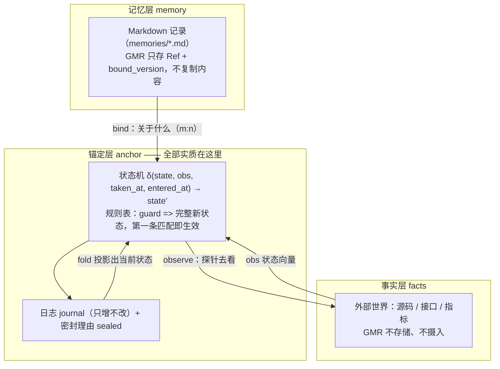
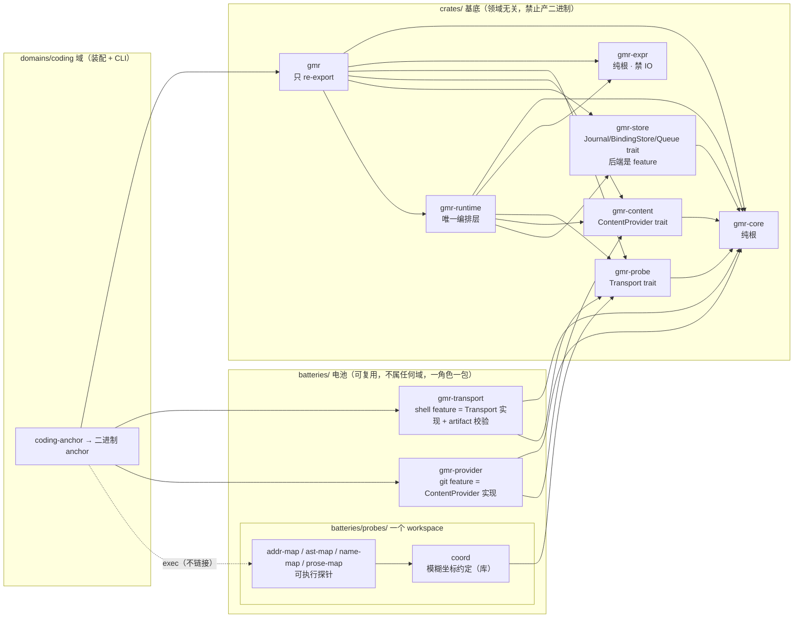
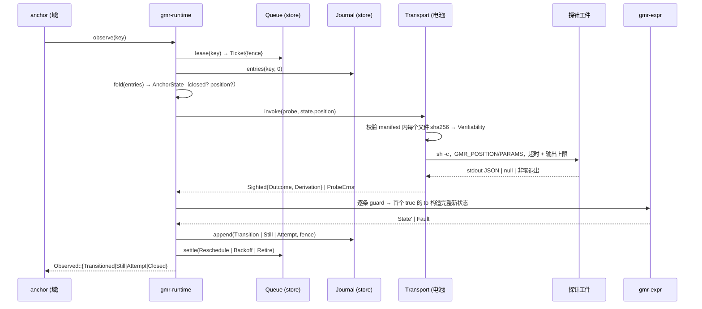

# GMR 架构解读（基于 main 分支代码实读）

结论先说：GMR 是**一台"给主观记录挂靠客观观测"的状态机运行时**。代码架构由三个正交的切分维度构成，读懂这三刀就读懂了全部：

1. **概念三层**：记忆层 → 锚定层 → 事实层（引用严格单向）
2. **物理三层**：`crates/`（基底，不产二进制）→ `batteries/`（可复用实现）→ `domains/`（装配 + 二进制）
3. **基底内部按"能力种类"切 6 个 crate**：词汇 / 求值 / 调用契约 / 存储契约 / 编排 / 门面

---

## 1. 概念三层与数据流



关键不变量（代码里能指出落点）：

| 不变量 | 落点 |
|---|---|
| 当前状态只能来自日志投影 | `gmr-core/src/journal.rs: fold/scan`（唯一投影，`scan` 让消费方不写第二份） |
| 只增不改由存储兑现 | `gmr-store/src/sqlite/schema.rs` 的 `BEFORE UPDATE/DELETE ... RAISE(ABORT,'append_only')` 触发器 |
| 终结不可逆由基底兑现 | `Anchor::is_terminal(state)` + runtime 在 open/observe/revise 前查 `closed` |
| 版本必须挣得来 | `Manifest::version()` = manifest 内容哈希；`Expr::seal()`；`ProbeRef::declaration_hash()` |
| 声明 / 派生 / 求值器三重身份不许合并 | `journal::Versions { declaration, derivation, evaluator }` |
| 不允许静默失败 | `Entry::Attempt{reason: Unreachable|Unusable|Unevaluable}`：求值炸了不转换但必发条目 |

---

## 2. 物理三层与包依赖图



- 允许的依赖方向写在 `architecture.toml` 的 `may_depend_on`，但目前只是声明——`gate.sh` 实际机械校验的是「禁区库清单」（`forbidden`/`forbidden_default`，逐个 `cargo tree` 比对）和「层间不许倒着依赖」（按 `crates/batteries/domains` 三个物理目录分层），两者都不读 `may_depend_on` 本身；这条字段目前还是文档，不是判据。
- `probe-impl` 层标了 `linkable = false`：探针只能被 `exec`，任何 `crates/` 下的包依赖它就算违规——但这条同样没有对应的机械检查，且 `addr-map`/`ast-map`/`name-map`/`prose-map` 活在 `batteries/probes/` 这个独立 workspace 里，根仓库的 `cargo tree -p <name>` 本来就够不到它们。
- **装配是域的决定**：选 shell 传输（`gmr-transport` 的 `shell` feature）/ git 提供方（`gmr-provider` 的 `git` feature）/ sqlite 后端这三行只出现在 `domains/coding/cli/Cargo.toml` 与 `main.rs`，基底一旦写死就不再领域无关。
- **一个角色一个包，不是一个实现一个包**：`gmr-transport`/`gmr-provider` 默认 feature 集是空的，不 ship 任何具体后端；加一个新后端（http 传输、mem0/Claude 原生记忆 provider）是加一个 feature + 一个模块，参照 `crates/gmr-store` 的 `sqlite` feature 同一惯例，不必再开一个新 crate。

---

## 3. 模块怎么分的：每个包的职责与边界

| 包 | 职责（给什么） | 边界（不许做什么） | 守卫方式 |
|---|---|---|---|
| **gmr-core** | 名词与地址：`Anchor/AnchorKey/State/StatusId/Rule/Transitions`、`Entry/Observation/Versions/Seq`、`Binding/Ref`、`Manifest/ProbeRef/Outcome`、JCS 规范化 + `content_hash_of`，以及**日志→状态的纯折叠 `fold/scan`** | 不知道怎么取事实、怎么算规则、怎么存；零 workspace 依赖 | `gate.sh` 纯根检查（`cargo tree` 里不许出现 `gmr-*`）；`architecture.toml: pure_root = true` |
| **gmr-expr** | 规则语言：`parse → Node → eval`，roots 只有 `obs/state/taken_at/entered_at`，builtins 只有 `exists()/changed()`，能构造对象（转换要吐完整 state）；`bind` 做拼错字段的**警告**；自带 `EVALUATOR_VERSION`（build.rs 由源码哈希算） | 纯、可终止、无 IO、无时钟、无随机；**不依赖 gmr-core**（求值器不认识锚） | 纯根检查 + `forbidden = ["io"]` 依赖禁区 |
| **gmr-probe** | 调用契约：`Transport { kind(), invoke(probe, position) -> Sighted }`、`ProbeError{reason, code}`。区分「世界的答案」`Outcome::NotFound` 与「我们的失败」`ProbeError` | 不放任何具体传输实现（无 tokio/reqwest/hyper） | `gate.sh` 显式 grep 依赖树 |
| **gmr-store** | 按**可变性**切三个 trait：`Journal`（只增，带 `Fence` 写入令牌）、`BindingStore`（只增 + `seal/sealed`）、`Queue`（可变：到期/租约/失败计数，可选）；sqlite 后端是 feature | 默认 feature 里不许出现数据库；基底 ship 接口不 ship 后端 | `forbidden_default = ["db"]` + `gate.sh` |
| **gmr-runtime** | **唯一编排层**：把 core/expr/probe/store 装成动词 —— `open · observe · pass/schedule · read/read_all/cobound · edges(changed_since) · health/corpus_health · bind · revise · close`；`translate.rs` 是"锚的规则表 → expr 求值"的唯一翻译点；`Policy` 管 cadence/lease/backoff | 不替领域做判断；不写死传输、提供方、后端（都以 `Arc<dyn _>` 由 `RuntimeBuilder` 注入）；持 trait object 是它的特权，core/expr 不许 | 依赖清单 + `RuntimeBuilder`；dev-dependencies 才出现真传输 |
| **gmr** | 门面，只重导出 | **不许定义任何类型或函数** | `gate.sh` grep `^pub (fn|struct|enum|trait|const|type)`；`cargo build -p gmr --no-default-features` |

电池与域：

| 单元 | 职责 | 边界 |
|---|---|---|
| **gmr-transport**（`shell` feature） | 把内容寻址的探针工件跑起来：`Artifacts::resolve` 逐文件校验 sha256 → 定 `Verifiability`，`sh` 执行、超时、输出上限（**超限拒绝而非截断**），`GMR_POSITION/GMR_PARAMS` 传入，`publish()` 生成 manifest 并算出版本。默认 feature 集是空的，不带 `shell` 就不 ship 任何具体传输 | 只实现 `Transport`；不解释 obs 内容；新增后端是加 feature + 模块，不是新开包 |
| **gmr-provider**（`git` feature） | `ContentProvider`：git blob 按 id 取回、**按版本取回**（判断"还在说同一件事吗"必须要 from→to） | 不进基底，由域挑；同样是空默认 feature 集 |
| **batteries/probes/coord** | 给探针作者的**模糊坐标约定**库：候选项 + "哪几项对上/没对上"（`exact`/`matches`/`candidates`），拆成 `env`（协议：读 `GMR_POSITION`/`GMR_PARAMS`，不可替换）与 `matching`（这套模糊匹配算法，目前唯一实现）两个模块 | 是建议不是基底规定；基底只知道有 `state.position` 这个槽 |
| **batteries/probes/{addr,ast,name,prose}-map** | 具体观测实现（tree-sitter 抽 pub 名册与签名等）；跟 `coord` 共用 `batteries/probes/` 这一个 workspace，源码哈希进 `extractor` | 不被链接，只被 exec；`gate.sh` 一条命令跑整个 workspace 的 fmt/clippy/test，新增 member 自动被覆盖 |
| **domains/coding/cli**（bin `anchor`） | 装配 + 分发 + 人类文本：解析 `anchors.toml` 声明、`rules.rs` 把 `GUARD => STATE` 切成 `Rule`、`render.rs` 出人读/JSON、`verbs/*` 一个动词一个文件；状态存 `<repo>/.anchor/memory.db` | 判断住在探针与表达式里，不住 CLI；`sync` 只开新锚**从不改判据** |

---

## 4. 三段边界（最重要的一刀：基底 / 语言 / 域）

```
① 基底规定死（域没有选择）
   探针输入 = state.position（域给）· 输出 = 可判等状态向量 · 失败契约必须与 NotFound 可分
   δ 的签名 · 求值炸了 → 不转换 + 发边沿 · 进终结态后拒绝一切后续写入

② 基底提供的语言（是规范，不是语义）
   路径取值 · 比较 · 逻辑 · 算术 · exists/changed · 对象构造
   小、纯、无时钟；时间只来自观测字段或日志已记录的时刻

③ 域完全自由（基底一个字都不说）
   state 里装什么 · status 叫什么名字 · 什么条件算转换 · 探针内部怎么实现
```

配套的两条读写边界：
- **表示归探针，注意力归锚**：探针吐它能看见的全部方向（数据形态），锚只声明在乎哪些（`rules` 是可读可 diff 的数据）。所以一个探针服务多个锚，不必重编译。
- **事件 vs 状况分格**：`Edge`（转换 / 终结 / 连续看不成）有游标可 `--since`；`Standing`（陈旧 / 被改写）不在日志里，按内容去重。混一格会让"上次之后"这个契约对所有类别一起失效。

---

## 5. 一次 observe 的调用链（端到端）



两个易被忽略的设计点：
- **两个失败计数器不合并**：世界够不着 → 指数退避 `backoff_secs(attempts)`；`Unevaluable`（判据本身写错）→ 直接拉到 `backoff_cap_secs`，第一次就出声。
- **令牌必须覆盖全部写路径**：`journal::guard()` 拒绝过期 fence，也拒绝在已被租约管理的锚上做无令牌的 sighting 写入 —— 留一条旁路就把担保降级成"大部分时候"。

---

## 6. 自举数据不是系统本体（读这个仓库最容易踩的坑）

`.anchor/anchors.toml` / `.anchor/probes.toml` / `architecture.toml` / `memories/` 是**本仓库作为 GMR 用户**的数据：GMR 用自己监督自己。它们不是 GMR ship 出去的能力、默认规则或产品清单 —— GMR 明确把"ship 一份该检测什么的清单"列为红牌。`gate.sh` 读 `architecture.toml` 是这个仓库的自举门禁，不代表别的用户必须有这份文件。

---

## 7. 读代码时发现的偏差（供你判断，未改动任何文件）

1. **README 与 CLI 实参不一致**：README 写 `probe = "batteries/probes/ast-map/... crates/gmr-core"`、`anchor open --probe '<命令行>'`；代码里 `.anchor/anchors.toml`/`OpenArgs` 要的是 `artifact = <64 位 sha256>` + `params`，命令行是 `--artifact`，工件先由 `anchor publish <dir>` 生成。README 少了 `publish` 这一步，也没提 `--params`。
2. **README 的 `Documentation` 链接指向根目录**（`GMR.md` / `flow.svg` / `modules.svg`），实际文件在 `docs/` 下。
3. README 说"每个锚报告 `settled · moved · still · unseen · closed`"，代码的 `Observed` 是 `Transitioned/Still/Attempt/Closed`，`settled/unseen` 是渲染层与 `Passed` 计数的词；`Retain::Full` 与 `--retain-full` 在 README 里没有出现。

这三条都属于文档滞后于"锚定层从无状态 diff 改成状态机"这次重构（README 自己标了 under reconstruction），不影响上面的架构判断。
