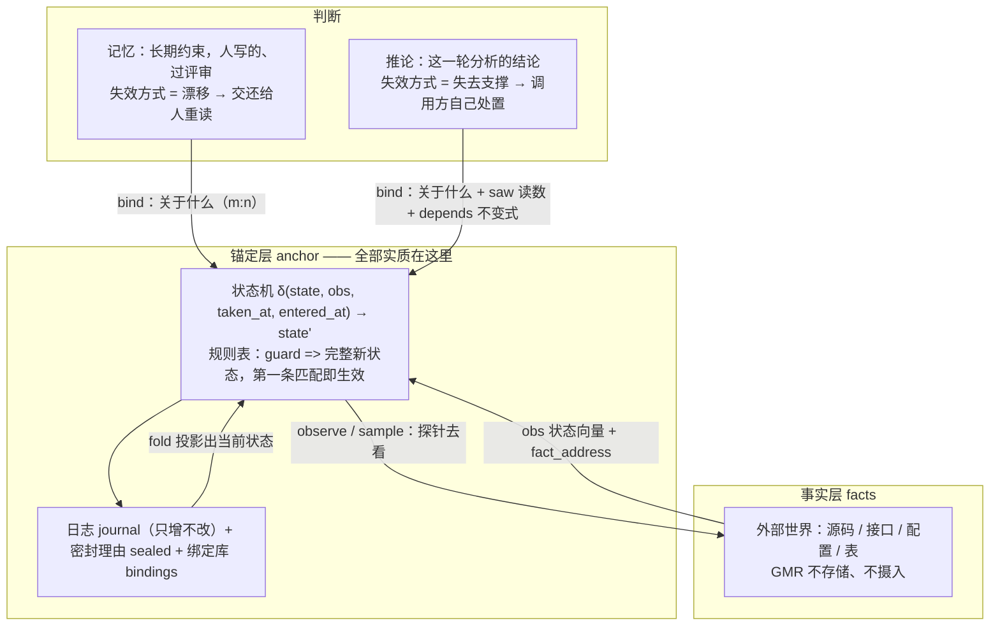
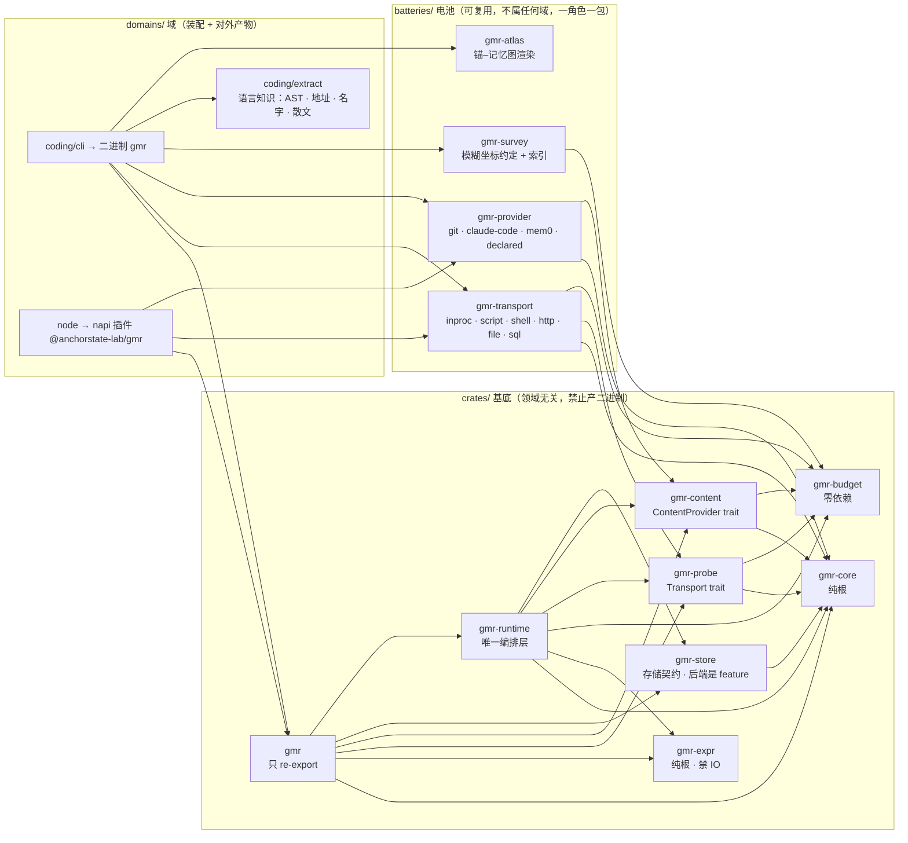
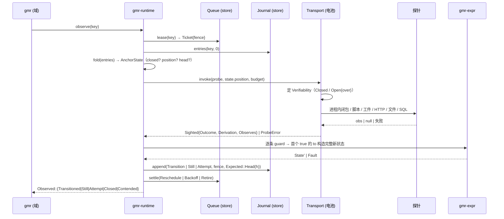
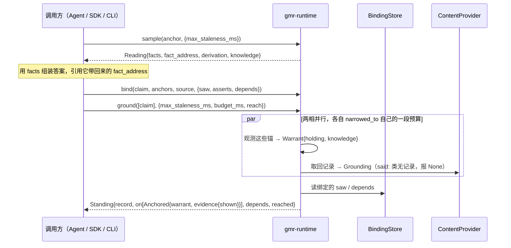

# GMR 架构解读

一句话：GMR 是**一台把主观判断挂靠到可重算观测上的状态机运行时**。代码架构由三个正交的切分维度构成，读懂这三刀就读懂了全部：

1. **概念分层**：事实层 ← 锚定层 → 记忆层 / 推论（引用严格单向）
2. **物理三层**：`crates/`（基底，不产二进制）→ `batteries/`（可复用实现）→ `domains/`（装配 + 二进制）
3. **基底内部按“能力种类”切包**：词汇 / 求值 / 预算 / 调用契约 / 内容契约 / 存储契约 / 编排 / 门面

---

## 1. 概念分层与数据流

锚定层是全部实质所在。它下面接事实，上面接两种性质不同的判断。



两条回路互不相通，合并处会说谎：

```
记忆回路   check  → 交还 → 人重读 → accept --why（封存理由）
推论回路   ground → holding / shown / depends → 调用方自己处置
```

判据存在哪由层决定：**记忆的判据住在仓库的文件里**（note 的 `watch:`，现读现用、可评审）；**推论的判据住在追加日志里**（绑定上的 `depends`，不可改，是当时相信了什么的证据）。

关键不变量（代码里能指出落点）：

| 不变量 | 落点 |
|---|---|
| 当前状态只能来自日志投影 | `gmr-core/src/journal.rs: fold/scan`（唯一投影，`scan` 让消费方不写第二份） |
| 只增不改由存储兑现 | `gmr-store/src/sqlite/schema.rs` 的 `BEFORE UPDATE/DELETE ... RAISE(ABORT,'append_only')` 触发器 |
| 并发正确性由写入自带前提兑现 | `Journal::append(anchor, entry, fence, expected)` —— `Expected::Head(seq)` 说出这条是从哪一条折算来的，对不上就拒绝；租约只是别让两台机器白烧同一次探针 |
| 日志可自证 | `Chained::chain_break()`：每条 entry 链住前一条，链断了报 seq |
| 终结不可逆由基底兑现 | `Anchor::is_terminal(state)` + runtime 在 open/observe/revise 前查 `closed` |
| 版本必须挣得来 | `Manifest::version()`、`Expr::seal()`、`ProbeRef::declaration_hash()`、抽取器由 `build.rs` 从语义闭包算 |
| 声明 / 派生 / 求值器三重身份不许合并 | `journal::Versions { declaration, derivation, evaluator }` |
| 不允许静默失败 | `Entry::Attempt{reason: Unreachable\|Unusable\|Unevaluable}`：求值炸了不转换但必发条目 |
| 基底不做蕴涵 | `Warrant` / `Shown` / `Depends` 各自报结构，不折成一个判决；折算是调用方的事 |

---

## 2. 物理三层与包依赖图



- 允许的依赖方向没有单独声明。`gate.sh` 机械校验两件事：「禁区库清单」（`architecture.toml` 的 `forbidden`，逐个 `cargo tree` 比对）和「层间不许倒着依赖」（按 `crates/batteries/domains` 三个物理目录分层）。分层检查用 `cargo metadata --manifest-path` 逐个读各层的 `Cargo.toml`，所以独立 workspace 也够得到。
- **语言知识住在域里**：`syn`/`tree-sitter`/`swc` 这类库在 `architecture.toml` 里叫 `domain`，基底与电池禁用。抽取器因此只能是 `domains/coding/extract`，不能上浮成电池。
- **装配是域的决定**：选哪些传输、哪些提供方、哪个存储后端，只出现在域的 `Cargo.toml` 与装配函数里；基底一旦写死就不再领域无关。
- **一个角色一个包，不是一个实现一个包**：`gmr-transport`/`gmr-provider` 默认 feature 集是空的，不 ship 任何具体后端；加一个新后端是加一个 feature + 一个模块，与 `gmr-store` 的 `sqlite` feature 同一惯例。

---

## 3. 模块怎么分的：每个包的职责与边界

| 包 | 职责（给什么） | 边界（不许做什么） |
|---|---|---|
| **gmr-core** | 名词与地址：`Anchor/AnchorKey/State/Rule/Transitions`、`Entry/Observation/Versions/Seq`、`Binding/Ref/Claim/FactAddress`、`Manifest/ProbeRef/Outcome/Verifiability`、JCS 规范化 + `content_hash_of`，以及**日志→状态的纯折叠 `fold/scan`** | 不知道怎么取事实、怎么算规则、怎么存；零 workspace 依赖 |
| **gmr-expr** | 规则语言：`parse → Node → eval`，roots 只有 `obs/state/taken_at/entered_at`，builtins 有 `exists()/changed()`，量词 `all/any/count(anchors, …)` 让一条不变式读整组锚；能构造对象（转换要吐完整 state）；自带 `EVALUATOR_VERSION`（build.rs 由源码哈希算） | 纯、可终止、无 IO、无时钟、无随机；**不依赖 gmr-core**（求值器不认识锚） |
| **gmr-budget** | 每一次对外调用共享的词汇：截止时刻、输出上限、可继承的取消（`Budget`/`Spent`、`narrowed_to`） | 只有这些。它谁都不依赖（连 serde 都不），所以谁都点得起它的名字 |
| **gmr-probe** | 调用契约：`Transport { kind(), invoke(probe, position, budget) -> Sighted }`、`ProbeError{reason, code}`、传输自报 `Verifiability`。区分「世界的答案」`Outcome::NotFound` 与「我们的失败」`ProbeError` | 不放任何具体传输实现（无 tokio/reqwest/sqlx） |
| **gmr-content** | 取回与枚举契约，分两级：人人必须做到的 `ContentProvider`；能力型的 `History`（取回绑定时那一版）与 `MemorySource`（枚举）—— 做不到就不实现，而不是被迫答一句「我没有」 | 不放具体提供方；不替谁决定该枚举哪个库、枚举多少 |
| **gmr-store** | 按**可变性**切契约：`Journal`（只增，`append` 带 `Expected` 前提）· `BindingStore` · `Sealer` · `LinkStore` · `Queue` · `Settings` · `Sightings`；能力型的 `Chained`（自证链条）；sqlite 后端是 feature | 默认 feature 里不许出现数据库；基底 ship 接口不 ship 后端。判定一样东西属于契约还是能力只问一句：**存储能拒绝它、并且仍然是完整的存储吗** |
| **gmr-runtime** | **唯一编排层**：`open · observe · pass/schedule · read/read_all · sample · ground · bind/revoke/reaffirm/claims · link/reaching · changed_since · health/corpus · revise · close`；`translate.rs` 是「锚的规则表 → expr 求值」的唯一翻译点；`Policy` 管 cadence/lease/backoff 与各段预算 | 不替领域做判断；不写死传输、提供方、后端（都以 `Arc<dyn _>` 由 `RuntimeBuilder` 注入）；不把 `holding`/`shown`/`depends` 折成一个判决 |
| **gmr** | 门面，只重导出 | **不许定义任何类型或函数** |

电池与域：

| 单元 | 职责 | 边界 |
|---|---|---|
| **gmr-transport** | 六种传输，各是一个 feature：`inproc`（进程内闭包，域把抽取器注册进来）· `script` · `shell`（内容寻址工件，逐文件校验 sha256 → 定 `Verifiability`，超时与输出上限，`GMR_POSITION/GMR_PARAMS` 传入，`publish()` 生成 manifest）· `http` · `file` · `sql`。`Recipes` 是**数据形态的声明入口**：TOML 与 JSON 反序列化成同一个 `Ask`，所以没有仓库、不写 Rust 的调用方也能声明探针 | 只实现 `Transport`；不解释 obs 内容；`Ask` 里的 `from_env` 只序列化变量名，绝不序列化值 |
| **gmr-provider** | `ContentProvider` 实现，一个后端一个 feature：`git`（按版本取回）· `claude-code`（无历史）· `mem0`（uuid 稳定）· `declared`（`providers.toml` 里由脚本声明的库）；`http` 是走网络的后端共用的脚手架，不是部署选项 | 不进基底，由域挑；空默认 feature 集 |
| **gmr-survey** | 给探针作者的**模糊坐标约定**：候选 + 「哪几项对上/没对上」（`exact`/`matches`/`candidates`），加上索引、收窄与遍历 | 是建议不是基底规定；基底只知道有 `state.position` 这个槽；不认识任何一门语言 |
| **gmr-atlas** | 把锚–记忆图渲染成一个自包含 HTML | 只渲染，不判断 |
| **domains/coding/extract** | 域的抽取器：AST · 地址 · 名字 · 散文。语言知识住在这里，版本由 `build.rs` 从语义闭包（源码 + 解析库锁定版本 + 输出契约）算出，跨机器相同所以两份日志比得起来 | 只被域装配进 `inproc` 传输 |
| **domains/coding/cli**（bin `gmr`） | 装配 + 分发 + 人类文本：`shapes.rs` 一套形状与坐标路由、`rules.rs` 把 `GUARD => STATE` 切成 `Rule`、`delivery.rs` 兑现 note 的 `watch:` 订阅、`memories.rs` 扫描与 lint、`render.rs` 出人读/JSON、`verbs/*` 一个动词一个文件；状态存 `<repo>/.anchor/state/memory.db` | 判断住在探针与表达式里，不住 CLI；`sync` 只开新锚**从不改判据** |
| **domains/node** | napi 插件：七个动词（`sample · ground · since · bind · revoke · open · close`）+ 一个 `Recipes` 入口。输入一律 `deny_unknown_fields` 反序列化，规则以字符串过境后在这一侧算哈希 | 不折算、不判断、不重试；调度（`pass`）与改判据（`revise`/`accept --criteria`）不过境 |

---

## 4. 三段边界（最重要的一刀：基底 / 语言 / 域）

```
① 基底规定死（域没有选择）
   探针输入 = state.position（域给）· 输出 = 可判等状态向量 · 失败契约必须与 NotFound 可分
   δ 的签名 · 求值炸了 → 不转换 + 发边沿 · 进终结态后拒绝一切后续写入
   报结构不报蕴涵：说「绑在哪、动没动、引的读数存不存在、不变式成不成立」，不说「所以这句话是假的」

② 基底提供的语言（是规范，不是语义）
   路径取值 · 比较 · 逻辑 · 算术 · exists/changed · 对象构造 · 对整组锚的量词
   小、纯、无时钟；时间只来自观测字段或日志已记录的时刻

③ 域完全自由（基底一个字都不说）
   state 里装什么 · status 叫什么名字 · 什么条件算转换 · 探针内部怎么实现 · 坐标怎么写
```

配套的三条读写边界：

- **表示归探针，注意力归锚**：探针吐它能看见的全部方向（数据形态），锚只声明在乎哪些（`rules` 是可读可 diff 的数据）。所以一个探针服务多个锚，不必重编译。
- **事件 vs 状况分格**：`Edge`（转换 / 终结 / 连续看不成）有游标可 `--since`；状况（陈旧 / 被改写）不在日志里，按内容去重。混一格会让「上次之后」这个契约对所有类别一起失效。
- **目击不进日志**：日志记「发生了什么」，每条不可改；目击库记「看过几次、最后一次何时」，是就地重写的计数器。一次「什么都没变」的观测不该在日志里留条目。

---

## 5. 一次 observe 的调用链（端到端）



三个易被忽略的设计点：

- **两个失败计数器不合并**：世界够不着 → 指数退避 `backoff_secs(attempts)`；`Unevaluable`（判据本身写错）→ 直接拉到 `backoff_cap_secs`，第一次就出声。
- **前提必须覆盖全部写路径**：`append` 带上折算所依据的 head，日志比对不上就拒绝，运行时重放折叠再试（`Observed::Contended`）。留一条不声明前提的旁路，就把担保降级成「大部分时候」。唯一例外是内容不由任何一次读决定的条目——观测失败的记录。
- **租约是效率装置**：它的价值是别让两台机器同时打同一个探针；正确性由上一条兑现。

---

## 6. 一次 ground 的调用链（推论侧）



四条轴各答一个问题，谁也不折进谁：

```
holding   这个锚建立起来的东西动了没有        每（claim, 锚）一份，纯计算
shown     这句话到底是不是照着那次读数说的    seen / unseen / not_said
depends   断言人自己写下的不变式还成不成立    holds / broken / vacuous / unevaluable / unstated
grounding 记录文本还在不在、还是不是那一版    每 claim 一份，要 IO
```

`sample` 存在的理由就是让交付路径与锚是**同一次看世界**：调用方自己读一遍再绑，是两次读数冒充一次，`shown` 会如实报 `unseen`。

---

## 7. 自举数据不是系统本体（读这个仓库最容易踩的坑）

`.anchor/anchors.toml` · `.anchor/probes.toml` · `.anchor/providers.toml` · `memories/` 是**本仓库作为 GMR 用户**的数据：GMR 用自己监督自己。它们不是 GMR ship 出去的能力、默认规则或产品清单 —— GMR 明确把「ship 一份该检测什么的清单」列为红牌。

`architecture.toml` 不属于这一批：没有任何 GMR 代码读它，它只是 `gate.sh` 的依赖禁区清单。一个包有没有依赖 tokio 由 `cargo tree` 完全决定，那是明确不该锚的一类。
