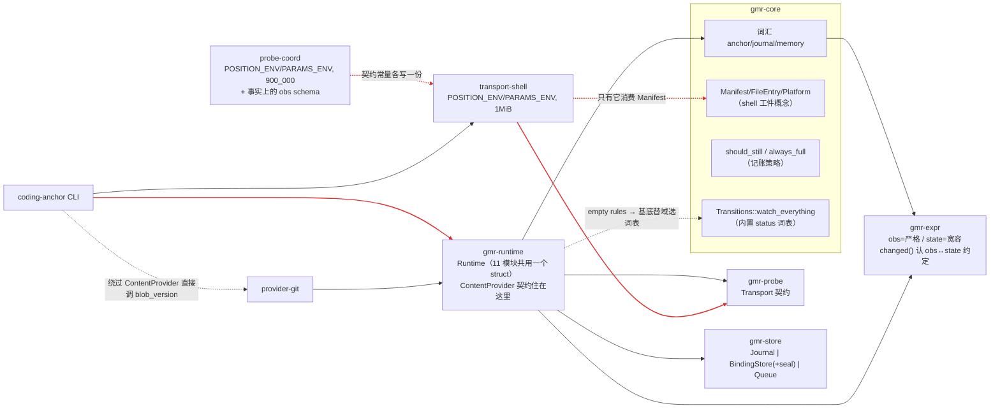

# GMR 细粒度模块划分 · 耦合与职责问题审查

范围：`crates/`（6 包 26 文件）、`batteries/`（7 包）、`domains/coding/cli`（20 文件）。判据用仓库自己的宪法：`CLAUDE.md` 十三条 + crate 边界 + `docs/GMR.md` §4 三段边界。**未改动任何文件**，行号对应当前 `main`。

> **已过时项**：`docs/rfc-binding-responsibility.md` 落地的三个 commit（a0da1a1/62e5ad5/0c3580d，随后 d65263a 补了 `reaffirm()`）已经解决了 **A4**（`seal`/`sealed` 拆成独立 `Sealer` trait，不再挂在 `BindingStore` 上）和 **D4** 里"`Link` 混进 `Binding`"的部分（拆成独立 `LinkStore`，CLI `bind` 不再传 `links` 参数）。D4 里"CLI 从未暴露 `link()`/`links_of()`"这半句仍然成立，见修复计划 Phase 4。下文 A4/D4 原文保留作为历史记录，不再代表当前代码状态。

---

## 一、文件级职责表

### 1. `gmr-core` —— 词汇 + 内容地址 + 唯一投影

| 文件 | 职责 | 对外的唯一入口 |
|---|---|---|
| `addr.rs` | JCS 规范化（键序无关、数字规范化、`-0.0→0`）、`ContentHash`、`content_hash_of{,_bytes}`、`canonical_write`（可写进 hasher，不建中间串） | 所有"版本挣得来"的地基 |
| `anchor.rs` | `AnchorKey/StatusId`（带校验的 newtype）、`Expr(seal→hash)`、`Rule{when,to}`、`Transitions`、`State`（`position()`/`status()` 两个槽）、`Anchor`、`Retain`、`Superseded`、`is_terminal` | 状态机的"名词" |
| `journal.rs` | `Entry` 六型（open/transition/still/attempt/revise/close）、`Versions` 三重身份、`Observation`、`Change` 四型、**`fold`/`scan`（唯一投影）**、`AnchorState`、`should_still`、`always_full` | 当前状态只能来自这里 |
| `probe.rs` | `ProbeRef`（声明）·`Derivation`（派生）·`Verifiability`、`Outcome{Found,NotFound}`+`address()`、`Manifest/FileEntry/Platform`、`MANIFEST_SCHEMA`/`OUTCOME_CONTRACT` | 「声明≠派生」这条线 |
| `memory.rs` | `Ref{provider,external_id}`、`Version`、`Binding{anchors,bound_version,links}`、`Link/LinkKind` | 记忆层只有引用 |

### 2. `gmr-expr` —— 规则语言（纯根，不依赖 core）

| 文件 | 职责 |
|---|---|
| `ast.rs` | `Root`（**恰好四个**：obs/state/taken_at/entered_at）、`Path/Step`、`BinOp`、`Node`、`reads_state()`（供 runtime 判断累加量）、`render()` |
| `parse.rs` | 手写递归下降：优先级三层、对象/数组构造、字符串、数字、**时长字面量（`30d` → 秒）**、`exists()/changed()`、`parse_path` |
| `eval.rs` | `Evaluated{Value,Absent,Fault}` 三态求值；`Fault` 六类；短路逻辑；类型不匹配不猜 |
| `ctx.rs` | `Ctx{obs,state,taken_at,entered_at}`（时间是 i64 参数，绝不读钟） |
| `bind.rs` | 用一次真实 obs 做"绑定检查"，路径拼错**只警告不拒绝** |
| `build.rs`+`version.rs` | `EVALUATOR_VERSION` = 本 crate 源码哈希（版本挣来的） |

### 3. `gmr-probe` —— 调用契约（唯一一个 trait + 错误分类）
`Transport{kind,invoke}`、`Sighted{outcome,derivation}`、`ProbeError{reason: ReasonClass, code: ProbeErrorCode}`；7 个错误码把「世界的答案」与「我们没看成」分开。

### 4. `gmr-store` —— 按可变性切的三份契约 + 一个后端
`journal.rs`（`Journal` + `Fence` + **`guard()`**：拒绝过期令牌、拒绝无令牌的观测写入）、`bindings.rs`（`BindingStore`：绑定 **+ seal/sealed**）、`queue.rs`（`Queue`/`Ticket`/`Disposition`）、`error.rs`（`ErrorKind`×`ErrorCode`）、`sqlite/{mod,schema,journal,queue,bindings}`（触发器兑现 append-only、`PRAGMA user_version` 拒绝跨代打开）、`testkit.rs`（内存参考实现，不是部署选项）。

### 5. `gmr-runtime` —— 一个 `Runtime` + 11 个动词模块

| 文件 | 动词 | 用到的依赖 |
|---|---|---|
| `assembly.rs` | `Runtime`/`RuntimeBuilder`/`anchors()` | 全部 |
| `policy.rs` | cadence/lease/backoff/batch/stalled 阈值 | — |
| `translate.rs` | **规则表 ↔ 表达式的唯一翻译点**：`compile`、`transition`、`bind_warnings` | expr |
| `observe.rs` | `observe`/`observe_with`/`record_attempt`/`invoke`/`observe_into` | transport+journal+queue |
| `open.rs` | `open`、`seal_supersede`、`accumulator_warning` | transport+journal+bindings(seal)+queue |
| `pass.rs` | `pass`/`schedule`/`cadence_of` | queue+journal |
| `read.rs` | `read`/`read_all`/`cobound`/`fetch_memory`/`carry_linked` | journal+bindings+providers |
| `edges.rs` | `changed_since`、`walk`（复用 `scan`）、`Edge`/`Standing` | journal+bindings+providers |
| `health.rs` | `health`/`corpus_health` | journal+bindings |
| `revise.rs` / `close.rs` / `bind.rs` | 带密封理由的写入 / 退休 / 绑定 | journal+bindings |
| `content.rs` | **`ContentProvider` 契约**（注意：契约住在编排层） | — |
| `error.rs` | `RuntimeError` + `code()` | — |

### 6. 电池与域

| 文件 | 职责 |
|---|---|
| `transport-shell/lib.rs` | `env_clear` + 白名单环境、`GMR_POSITION/GMR_PARAMS` 注入、30s 超时、1 MiB **拒绝而非截断**、stdout `null`→`NotFound`、非零退出→`Unreachable` |
| `transport-shell/artifact.rs` | `Artifacts::resolve`（manifest 自哈希 + 逐文件 sha256 + 路径逃逸检查）、`publish` |
| `provider-git/lib.rs` | `ContentProvider`：`fetch`（当前版本 = blob oid）、`fetch_at`（按版本取回）、`blob_version` |
| `probe-coord/lib.rs` | 模糊坐标约定：`position/params/wanted/nth`、`report`（matched/missed/exact/candidates/matches/priority）、`emit`、`MAX_BYTES` |
| `probe-{ast,name,addr,prose}` | 具体观测；把自身源码哈希当 `extractor` 字段吐回 |
| `cli/main.rs`+`cli.rs`+`rules.rs`+`render.rs`+`error.rs`+`verbs/*` | 装配三块电池、解析 `anchors.toml`、`GUARD => STATE` 切分、人读/JSON 渲染、15 个动词 |

---

## 二、实际耦合图（红色 = 我认为不该存在的边）

---

## 三、问题清单

### A. 与仓库自己声明的原则直接冲突（建议优先处理）

**A1 基底内置了 status 词表和默认判据**
`gmr-core/src/anchor.rs:90-101` 的 `Transitions::watch_everything()` 写死了 `"captured"` / `"moved"` 两个 status，`gmr-runtime/src/open.rs:54-58` 在规则表为空时**静默替换**成它。
- 冲突点：`CLAUDE.md` 第 4 条「没有固定状态词表，status 由域定义」；`GMR.md` §4③；README「ship 一份该检测什么的清单是红牌」。
- 后果：空规则表的锚，其词表来自基底；域读日志时看到的 `status` 不是自己写的。
- 建议：空规则表返回错误（`OpenRequest` 用非空类型表达），或把 `watch_everything` 下移到 `domains/`。

**A2 `gmr-core` 装了 shell 传输的实现细节**
`probe.rs:1200-1249` 的 `Manifest{entrypoint,args,env,files:Vec<FileEntry>,platform}`、`Platform::host()`、`FileEntry.executable`。
- 冲突点：`CLAUDE.md`「core 是词汇 + 内容地址 + Entry + fold，不能知道怎么取事实」。文件、可执行位、os/arch 是**脚本传输独有**的概念；HTTP 传输里它们没有意义。唯一消费者是 `transport-shell/artifact.rs`。
- 附带证据：`executable` 参与 manifest 哈希（因此参与版本身份），但 `resolve()` 从不校验它 —— 一个既影响版本又没有语义的字段。
- 建议：`Manifest` 系列下沉到 `transport-shell`（或新 `gmr-artifact`），core 只留 `ProbeVersion/ProbeRef/Derivation/Outcome/Verifiability`。

**A3 `ContentProvider` 契约住在编排层，与 `Transport` 不对称**
`gmr-runtime/src/content.rs` 定义契约，于是 `batteries/provider-git` 必须依赖**整个 gmr-runtime** 才能实现一个 6 行的 trait；而对称的 `Transport` 有自己的契约 crate `gmr-probe`。
- 后果：电池层反向拖进编排层，`gate.sh` 的分层检查看不出来（batteries → crates 是合法方向）。
- 建议：抽 `gmr-content` 契约 crate，或明确承认"契约都住 runtime"并把 `gmr-probe` 也合并 —— 两条路都行，现状是两套标准并存。

**A4 `BindingStore` 混了「绑定」和「密封库」两件事**
`gmr-store/src/bindings.rs` 同时提供 `bind/bindings_on/binding_of/all`（记忆层）与 `seal/sealed`（内容寻址 blob）。密封的使用者全在锚定层：`open.rs:135`、`revise.rs:41,44`、`close.rs`、`health.rs:59`。
- 冲突点：`GMR.md` §8 声明按可变性切三份存储；密封是第四类东西，被塞进了绑定库，于是"存一条修订理由"要走 `self.bindings`。
- 建议：拆 `SealStore`（仍可共用一个 sqlite 后端），`Runtime` 上出现 `seals()` 而不是借道 `bindings()`。

**A5 `gmr-expr` 声称"不认识锚"，实际内嵌了锚定层策略**
- `eval.rs:56`：`lenient = matches!(p.root, Root::State)` —— **obs 缺字段是 Fault，state 缺字段只是 Absent**。
- `eval.rs:81` `changed(name)` = 比较 `obs.<name>` 与 `state.<name>`，这是"表示 vs 注意力"的约定。
- 判断：这两条是**substrate 的语义决定**，不是通用求值器特性。不一定要改实现（这个非对称正是"拼错要响、状态没长出来不要响"），但边界描述（`CLAUDE.md`「不能依赖 gmr-core」被当成了"不认识锚"）与实现不符，应写明。

**A6 `EVALUATOR_VERSION` 没覆盖真正决定比较语义的东西**
`gmr-expr/build.rs` 只哈希 `src/*.rs` + `Cargo.toml`。但数字解析/格式化、`Value` 相等与序列化语义实际来自 `serde_json`，`Cargo.lock` 与依赖版本都不进哈希。
- 后果：升一次 `serde_json` 就可能改变比较结果，而日志声称"同一个求值器" —— 正是 `GMR.md` §5「派生规则升级的爆炸半径」要防的失效模式。
- 建议：把锁定的依赖版本（或 `Cargo.lock` 中本 crate 的依赖闭包）一并进哈希。

### B. 结构性耦合与职责不清

**B1 `Runtime` 是 god object**
11 个文件全部 `impl Runtime`，一个结构体持 `transports + journal + bindings + providers + queue + policy`（`assembly.rs:9-16`）。`read/bind/health/edges` 不需要 transports，`open/observe/pass` 不需要 providers，但都拿得到；新增动词天然拥有全部能力。
- 建议：按依赖切服务 —— `AnchorLog`(journal+fold) / `Observer`(transport) / `MemoryLens`(bindings+providers) / `Scheduler`(queue)，`Runtime` 退化成装配 + 门面。

**B2 每个动词全量重放日志，`Journal::entries` 的 `from` 是死参数**
13 处调用全部是 `entries(key, 0)`（health×2、edges、close、pass×4、open×2、observe、read、revise）。
- `pass()` 每个 ticket 最多 4 次全量读 + fold：`observe_with:59`、`pass.rs:61`（取 attempts）、`pass.rs:76`（判 terminal）、`cadence_of:94`。这三个量 `fold` 一次就都有了。
- `read_all`/`corpus_health`/`changed_since` 是 O(锚数 × 全量日志)。
- `changed_since` 还对**每个锚的每条绑定**跑 `fetch_memory`（`edges.rs:96-107`）：读全文件 + 若被改写再按版本取一次 → `anchor edges --since <seq>` 的成本与游标无关，游标只用于过滤输出。
- 建议：`observe_with`/`pass` 之间传递已 fold 的 `AnchorState`；`Standing::Rewritten` 的提供方查询单独成一个动词或加开关。

**B3 `Observed::Transitioned` 撒谎，两个消费方各自纠正**
状态没变但 fact_address 变了时也走 `Entry::Transition` → `Observed::Transitioned{from,to}` 且 `from == to`。于是 `verbs/observe.rs:16` 要写 `if from == to => "settled"`，`pass.rs:528` 要写 `if from != to => moved += 1`。
- 建议：加 `Observed::Unchanged`（或 `Restated`），把语义留在 runtime，不让每个消费方重算。

**B4 派生量在三处各算一遍（第二份投影只是没叫这个名字）**
`edges.rs` 正确地复用了 `scan`，但 `health.rs:42-71` 自己又遍历一遍 entries 算 `restate_interval/rationale_sizes/last_failure/stall_ratio`；`read.rs:186 count_sightings` 又数一遍条目；`revisions` 则是 `fold` 里算好的。
- 风险与注释里承认的一样：两份走查对"什么算失败/什么算一次修订"迟早分家，而没人会注意。
- 建议：这些量进 `scan` 的回调或进 `AnchorState`。

**B5 `sync` 顺手当了调度器复位键**
`verbs/sync.rs:79` 对每个声明的锚调 `rt.schedule()`；`Queue::enqueue` 的 sqlite 实现是 `ON CONFLICT DO UPDATE SET due=?, lease_until=0, parked=0`（`sqlite/queue.rs:24-26`）。
- 后果：每次 `anchor sync` 把退避中/已停摆（parked）的锚全部复位并立刻到期。`open.rs:112` 的警告写的是"下一次 sync 会修好队列"，实现却是无条件复位 —— "补一条缺失的队列项"和"清空所有退避"混进了一个动词。
- 建议：`schedule` 分成 `ensure_enqueued`（缺则补）与 `requeue_now`（显式复位）。

**B6 `has_lease()` 把"部署有队列"当成"这次写有租约"**
`assembly.rs:35` `queue.is_some()`。`open.rs:139-153` 的累加量警告因此按部署形态判断，而真正决定是否会重复计数的是**这次写走的是不是租约路径**（`Fence::Held` vs `Unleased`）。

**B7 core 悄悄扩了"记账策略"**
`journal.rs:129 should_still` 与 `journal.rs:269 always_full` 是 observe 的记账决策，住在词汇 crate 里，被 runtime 以自由函数调用。`Retain` 在 `anchor.rs`、读它的函数在 `journal.rs`，位置也对不上。

### C. CLI / 域层的职责错位

| # | 现象 | 位置 |
|---|---|---|
| C1 | `Command::Health` 由 `verbs/edges.rs::health` 处理，`verbs/` 的"一动词一文件"约定破了 | `main.rs:88`, `verbs/edges.rs:81` |
| C2 | `doctor` 在 CLI 里重算 absent/unseen/**barren**，而 runtime 的 `corpus_health` 已有 barren；两处定义不同（CLI 用 `memories.is_empty()`，runtime 用绑定计数）→ 可以给出互相矛盾的答案 | `verbs/doctor.rs:6-23` vs `health.rs:98-108` |
| C3 | `bind` 直接调 `gmr_provider_git::blob_version` 取版本，绕过已注册的 `ContentProvider`；提供方被选了两次，"什么算版本"由 CLI 说 | `verbs/bind.rs:20` |
| C4 | `--detach` 只影响打印文案：`detach` 从未传给 runtime，卸载靠 clap 的 `conflicts_with` 让 `anchors` 为空 + 追加一条空绑定 → 语义正确纯属实现巧合 | `verbs/bind.rs:14-30`, `cli.rs` |
| C5 | `read --moved` 的过滤是 `attempts > 0 \|\| status.is_some()`，而几乎所有锚都有 status → `--moved` 实际近似"全部" | `verbs/read.rs:18` |
| C6 | `main.rs` 为 `Publish` 特判在建 Runtime 之前，再在 match 里留一个 `unreachable!()` | `main.rs:39-47, 65` |
| C7 | `Runtime::cobound`（GMR.md §6 的"同锚共存"查询）从未被 CLI 暴露 | `read.rs:78` |

### D. 类型没表达不变量 / 死面 / 重复契约

| # | 现象 | 位置 |
|---|---|---|
| D1 | `Expr.source: Value`，但实现只支持字符串（`compile` 报 "the expression is not text"）→ 类型承认的状态多于支持的 | `anchor.rs:63`, `translate.rs:621-626` |
| D2 | `AnchorState.revisions: BTreeMap<String,u32>`，键是 `Change::kind_name()` 字符串，`health.rs:75` 用魔法字符串 `"restate"` 取值 → 违反 `CLAUDE.md`「用枚举表达状态，不用字符串」 | `journal.rs:252`, `health.rs:75` |
| D3 | `Verifiability::{Declared,Unverifiable}` 无任何生产者（全系统只产 `ContentAddressed`）→ 类型承诺了一个还没有的谱系 | `probe.rs:1255-1261` |
| D4 | `Link/LinkKind` 只在测试里被构造，CLI `bind` 永远传 `vec![]` → `read.rs::carry_linked`（"链接被携带不被执行"这条设计）是死路径 | `verbs/bind.rs:28`, `read.rs:110` |
| D5 | `POSITION_ENV/PARAMS_ENV` 在 `transport-shell/lib.rs:18-20` 与 `probe-coord/lib.rs:6-8` **各写一份**；输出上限也各写一份且口径不同（1 MiB vs 900_000）→ 传输契约有两个副本，改一处不会有人报错 | 同上 |
| D6 | **事实上的 obs schema 住在一个电池里且没有版本**：`probe-coord::report` 固定吐 `found/matched/missed/at/facts/candidates/exact/priority/matches`，`anchors.toml` 全部规则依赖 `obs.exact / obs.candidates / obs.matches`。probe-coord 改字段名 = 静默改掉所有锚的判据输入，而它不像 `OUTCOME_CONTRACT` 那样有 schema 常量参与哈希 | `probe-coord/lib.rs:88-140`, `anchors.toml` |
| D7 | `--status` 过滤时把 `standing` 整个清空（"不要搅浑这个问题"），但消费方无从知道被清了 → 一个过滤器顺手取消了另一整类信息 | `edges.rs:110-117` |
| D8 | `revise.rs:31-39` 与 `close.rs:18-24` 各自手搭 context JSON（字段不同、无共享构造器）→ 密封上下文的形状没有类型 | 同上 |
| D9 | `RuntimeError::CannotOpen{message}` 与 `Observed::Attempt{message}` 把 `ProbeErrorCode` 压成字符串 → 结构化错误在跨层时丢掉，CLI 只能打印 | `error.rs:24`, `observe.rs:144` |

---

## 四、看着像问题、其实是有意为之（不建议动）

- **`Fence` 定义在 journal 模块却被 `Queue` 用**：租约发令牌、日志校验令牌，必须共享一个类型；`GMR.md` §8 明确"租约单独不够，必须配写入令牌"。
- **修订/关闭走 `Fence::Unleased`**：作者的修订不是第二个观测者（§8 末），`guard()` 只对 sighting 强制令牌。
- **`gmr-expr` 不依赖 `gmr-core`，于是 `State ↔ Value` 的转换堆在 `translate.rs`**：这是纯根的代价，不是漏洞。
- **`open` 时求值失败只警告不拒绝**：§10 代价 4「绑定只有警告，没有拒绝」，锚可以先于目标存在。
- **sqlite 用触发器拒绝 update/delete**：这是"只增不改由存储兑现"的落点，不是把逻辑写进 SQL。
- **`gate.sh` 里的 python 内联脚本**：判据只有 `architecture.toml` 一份拷贝，是刻意避免多份清单。
- **`Runtime` 持 `Arc<dyn _>`**：`CLAUDE.md` 明确允许装配层持 trait object。

---

## 五、如果只做三件事

1. **A2 + A4**：把 `Manifest` 系列移出 `gmr-core`，把 `seal/sealed` 从 `BindingStore` 拆出来 —— 这两刀让 crate 边界重新对得上 `CLAUDE.md` 的一句话描述。
2. **A1**：删掉 / 下移 `watch_everything`，空规则表要么拒绝要么由域给 —— 这是唯一一处基底自己踩了自己的红牌。
3. **B2 + B4**：让 fold 的结果在动词内部只算一次并向下传递（`pass` 现在最多 4 次全量重放），顺手把 health 的第二份走查并进 `scan`。

D5 / D6（契约常量与 obs schema 的重复）成本最低、收益也实在：给 probe-coord 的报告加一个带版本的 schema 常量，并让两处环境变量名与输出上限只有一份定义。
